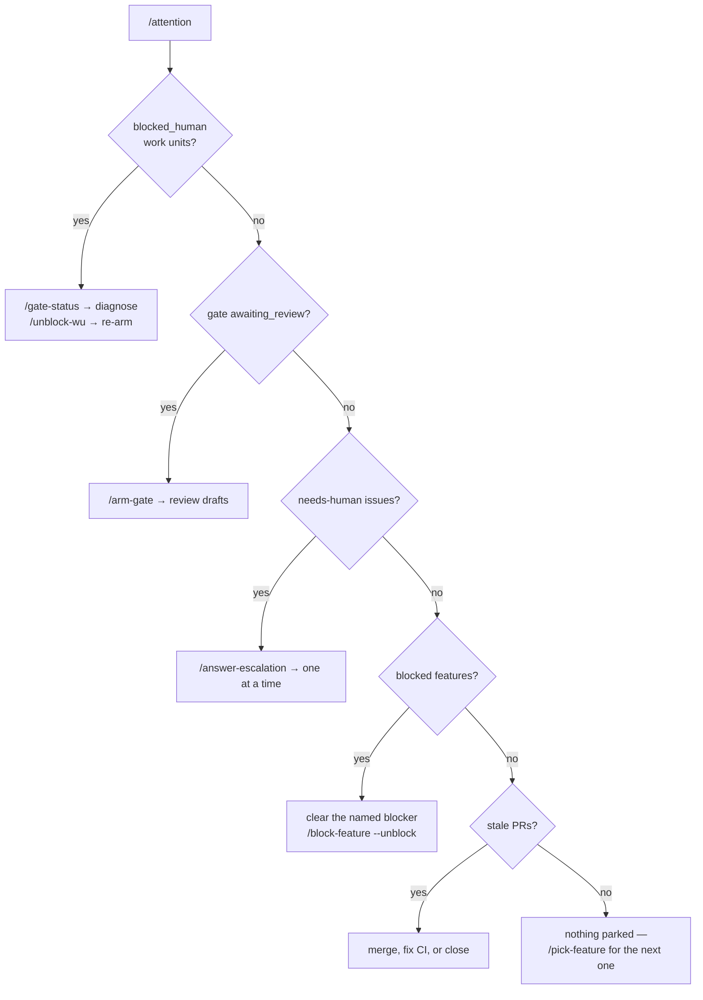
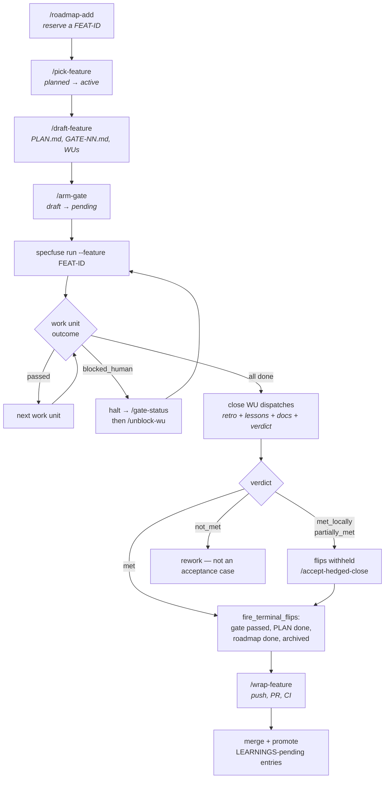
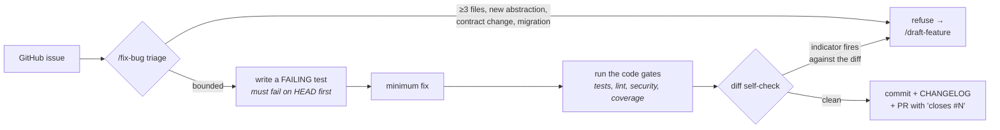
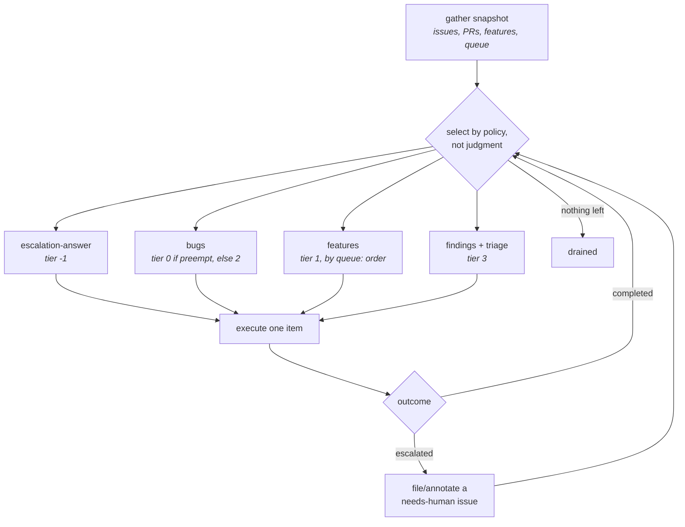
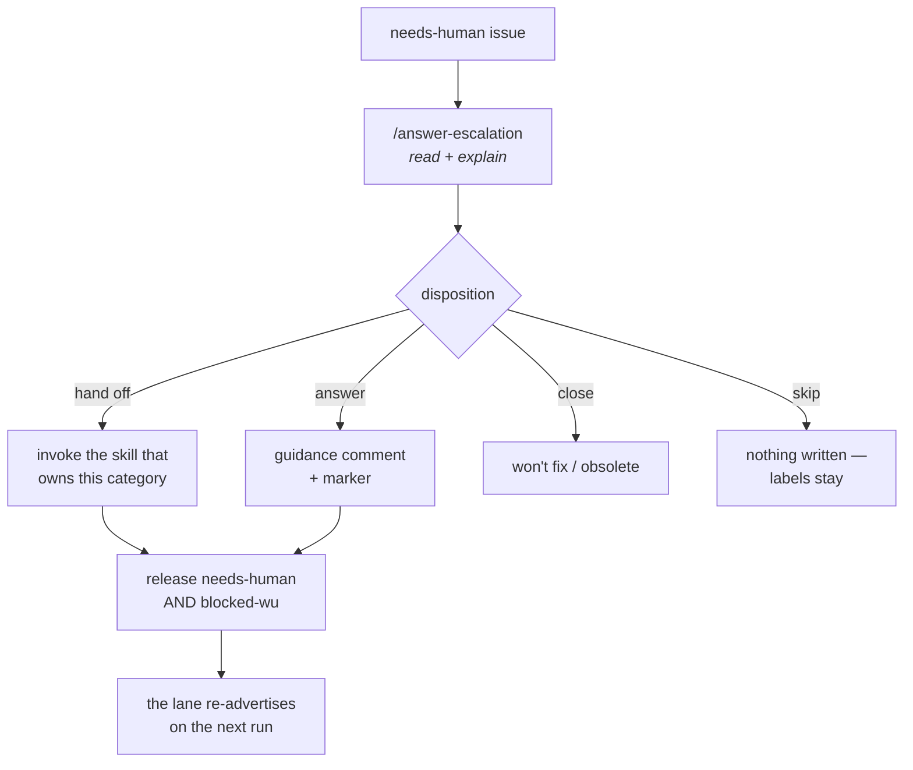
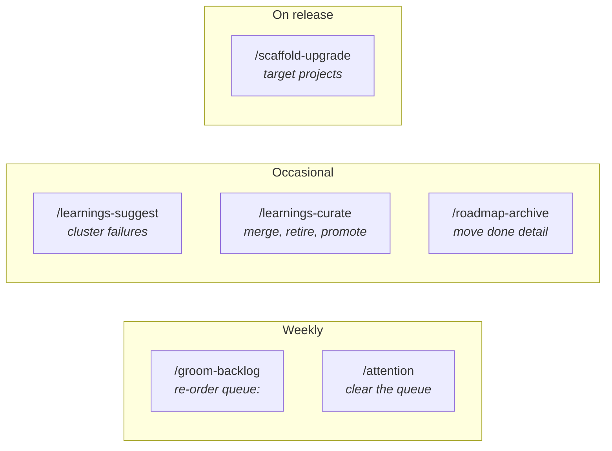
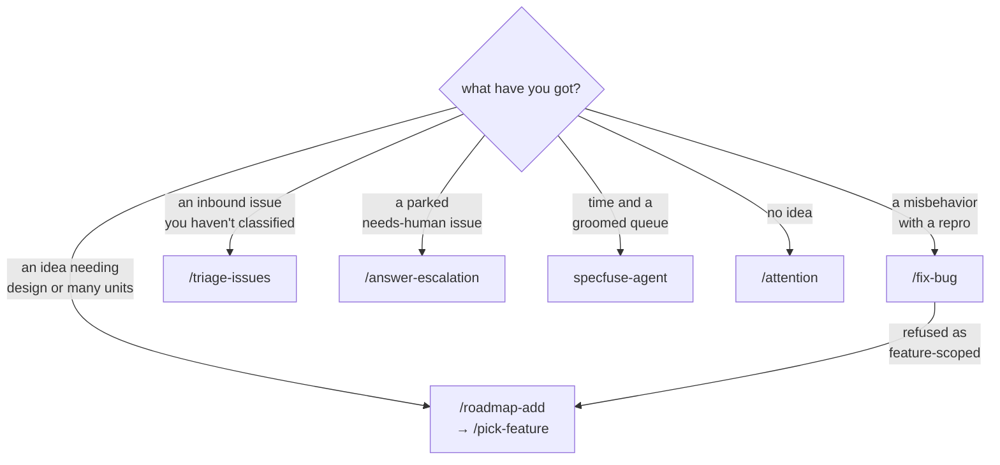

<!--
Copyright 2026 Specfuse Contributors
Licensed under the Apache License, Version 2.0. See LICENSE.
-->

# Lifecycles — how you actually use the loop, day to day

[`skills.md`](skills.md) is the catalog: what each skill does, one entry at a
time. This document is the other half — **which lifecycle you are in, what the
loop does for you inside it, and the specific points where it stops and needs
you.**

There are five ways work moves through a Specfuse project. They are not
variations on one process; they have different entry points, different
guarantees, and different human checkpoints:

| Lifecycle | Entry point | Ceremony | Who drives |
| --- | --- | --- | --- |
| [Feature](#1-the-feature-lifecycle) | a roadmap row | gates, work units, close | driver + you at gate boundaries |
| [Bug](#2-the-bug-lifecycle) | a GitHub issue | none — 1 bug = 1 branch = 1 PR | `/fix-bug`, test-first |
| [Autonomous](#3-the-autonomous-lifecycle) | `queue:` + open issues | inherits whichever lane it selects | `specfuse-agent`, unattended |
| [Escalation](#4-the-escalation-lifecycle) | a `needs-human` issue | none | you, one issue at a time |
| [Maintenance](#5-the-maintenance-lifecycle) | a calendar | none | you, periodically |

**The one rule that explains all the checkpoints.** The loop automates
execution, not judgment. Every place it stops is a place where proceeding would
mean guessing at something only you can decide — which feature matters, whether
a drafted work unit is right, whether a hedged verdict is acceptable. It halts
rather than guesses, and it says why.

---

## Where to start: the daily check-in

Sitting down to a project, one command answers "what needs me?":

```
/attention
```

Read-only. It sweeps local `.specfuse/` state and the `needs-human` GitHub queue
into one priority-ordered list, so you work top-down instead of remembering
which feature was mid-flight.



The priority order is not arbitrary. A `blocked_human` work unit means an agent
already tried and gave up, so the loop is stalled until you act; a stale PR is
merely waiting. Work the list top-down and you clear the most blocking thing
first.

---

## 1. The feature lifecycle

For planned work: anything needing design, multiple work units, or a record of
why it was built. Features get gates, work units, and a close ceremony.



### The four places it stops for you

**Arming a gate.** The driver never flips a `draft` work unit to `pending`.
Gate 1's units are armed when you draft the feature; every later gate's units
are drafted by the previous gate's `plan-next` and wait for `/arm-gate`. This is
the review checkpoint — you read what the loop proposes to do next *before* it
does it.

**A blocked work unit.** Three failed attempts, a guard refusal that repeats, a
missing credential. The driver halts and files an escalation rather than
burning attempts. Run `/gate-status` for the diagnosis, fix the cause, then
`/unblock-wu` to re-arm.

**A hedged verdict.** A close that passes with `met_locally` leaves the gate,
`PLAN.md`, and the roadmap row deliberately un-flipped. That is the
verdict-coupling rule working: some criteria have oracles outside the repo —
a live API round-trip, a deploy — and no amount of in-loop work closes them.
Either discharge the named follow-up, or accept the hedge with
`/accept-hedged-close`, which records your reason and carries the open items
forward.

> **Discharging beats accepting when the condition is reachable.** A follow-up
> whose re-run condition you can satisfy today gives you a `met` verdict on
> evidence instead of a signature. Read the follow-up record before reaching for
> the acceptance skill.

**A budget ceiling.** `GATE-NN.md`'s optional `cost_budget_usd` halts the gate
between work units once cumulative spend reaches it. Raising it is a deliberate
act — record why in the gate file, not only in a commit message.

### Cost discipline

Each work unit carries `planned_cost_usd`, and the close reconciles plan against
actual from `events.jsonl`. Two failure modes are common enough to name:

- **Pricing a unit for the surface it touches rather than the oracle it is
  judged by.** A work unit whose acceptance is structural — tests asserting on
  file contents — is a documentation unit, whatever the shipped artifact
  eventually drives.
- **Budgeting for retries.** A closing-unit retry is a defect to diagnose, not a
  cost to absorb. If a close spins, find out why before raising the ceiling.

---

## 2. The bug lifecycle

Bugs do **not** use the feature methodology. No `PLAN.md`, no gates, no
retrospective, no roadmap row. The fix shape is known, so the ceremony is
overhead.

**1 bug = 1 branch = 1 PR.** Hard contract.



**Test-first is not negotiable.** The failing test is the falsifiable claim that
you fixed the right thing. A test written after the fix proves only that the
code does what it does.

**The diff self-check exists because triage runs too early.** Step 2 judges the
issue text, before any code exists. A feature indicator can be invisible then
and obvious in the diff — a fix that turns out to need a new frontmatter field,
say. So the indicators are re-applied to the actual diff before commit, and a
hit stops the branch rather than shipping feature-scoped work as a bug fix.

**The `CHANGELOG.md` entry is written here or nowhere.** Bugs have no close
ceremony to collect through, so `/fix-bug` is the collection point.

---

## 3. The autonomous lifecycle

`specfuse-agent` is a conductor. It owns no capability of its own — it selects
among lanes that already exist and keeps selecting until the work drains or your
budget does.

```
specfuse-agent [--repo OWNER/NAME] [--max-items N] [--max-minutes M]
```

`--repo` is optional from inside a checkout: it defaults to whatever
`gh repo view` resolves, falling back to the `origin` remote. A run that can
determine no repo exits non-zero rather than draining, because a conductor
with no repo has nothing to select from (#2271).



### What it will and will not do

It **will** advance a feature by invoking `specfuse run`, fix a triaged bug via
headless `/fix-bug`, triage issues, diagnose findings, and fire autofixes.

It **will not** arm a gate, draft a feature, or answer an escalation on your
behalf. Those are the judgment checkpoints, and it escalates instead.

### Feature-lane preconditions

A feature is only picked up when **all** of these hold. Miss one and it is
silently invisible:

1. Its `FEAT-ID` is in `queue:` in `.specfuse/agent-policy.yml`. Disk state is
   not enough — the provider iterates the queue, not the features directory.
2. A feature folder exists with a readable `PLAN.md`.
3. `PLAN.md` `status` is `active` or `planned`.
4. The next un-passed gate has `pending` work units, not `draft`.
5. A WIP slot is free (`rules.features.wip_limit`, default 1).

> **The starvation case worth knowing.** `awaiting_review` does not change
> `PLAN.md` `status`, so a feature parked at a gate boundary keeps consuming the
> only WIP slot indefinitely. The next feature in `queue:` never runs until you
> arm the gate or reorder the queue.

### Budgets and the kill switch

`budgets:` in `agent-policy.yml` caps tokens, items per day, and open PRs. A
`PAUSE` marker is checked each iteration, so you can stop a run without killing
the process. Every run holds `.specfuse/.agent.lock` — one agent per repo.

---

## 4. The escalation lifecycle

When any lane cannot proceed, it files a GitHub issue labelled `needs-human`
plus a category. That queue is the authoritative record of what is parked.



Each category has an owning skill:

| Category | Owner |
| --- | --- |
| `gate-review` | `/arm-gate` |
| `drafting-needed` | `/draft-feature` |
| `blocked-wu` | `/unblock-wu`, or `/roadmap-add` to promote |
| `triage-question` | `/triage-issues` |
| `merge-approval` | merge by hand |

**Two details that decide whether this works.**

*Both labels, always.* `BugsProvider` skips an issue carrying `needs-human`
**or** `blocked-wu`. Releasing only one leaves the issue answered and still
parked.

*Guidance, not just an unpark.* Releasing the label alone makes the lane retry
an unchanged problem and collect the same refusal. The comment is the point: it
is what makes the next attempt different from the last.

---

## 5. The maintenance lifecycle

Periodic rituals. Nothing breaks immediately if you skip them; things quietly
degrade.



- **`/groom-backlog`** — `queue:` goes stale the week it is written. Features
  complete, blockers clear. A `done` entry sitting at the top means the feature
  lane advertises nothing at all.
- **`/learnings-suggest`** → **`/learnings-curate`** — the first clusters
  non-passing attempts into candidate rules; the second bounds the file. Planning
  loads `LEARNINGS.md`, so its size is a standing cost.
- **Promote `LEARNINGS-pending.md` at PR review.** Under `autonomy_default:
  auto`, lessons stage in the feature folder rather than landing in
  `.specfuse/LEARNINGS.md`, because no human read the gate before they were
  written. **Planning never reads the staging file.** Merging the PR does not
  promote them — copying them across is a human act, and skipping it silently
  discards everything the run learned.

---

## Choosing a lifecycle



**When `/fix-bug` refuses, believe it.** A refusal means an indicator fired —
three or more files, a new abstraction, a consumer-visible contract change, an
irreversible migration. Forcing a bug-sized fix through produces the worst
outcome: feature-scoped work with no plan, no gates, and no record.

---

## See also

- [`skills.md`](skills.md) — every skill, one entry each, ordered by phase.
- [`getting-started.md`](getting-started.md) — `specfuse init` through a first
  delivered feature.
- [`methodology.md`](methodology.md) — the canonical gate cycle: unit hierarchy,
  the five-section work-unit contract, verification-as-oracle, auto-close.
- [`glossary.md`](glossary.md) — the vocabulary, in the order you meet it.
- [`concepts/autonomy-stop-classes.md`](concepts/autonomy-stop-classes.md) — the
  deterministic classes checked before a gate arms under `auto`.
- [`concepts/adopting-auto-mode.md`](concepts/adopting-auto-mode.md) — moving a
  feature to `autonomy_default: auto`.
